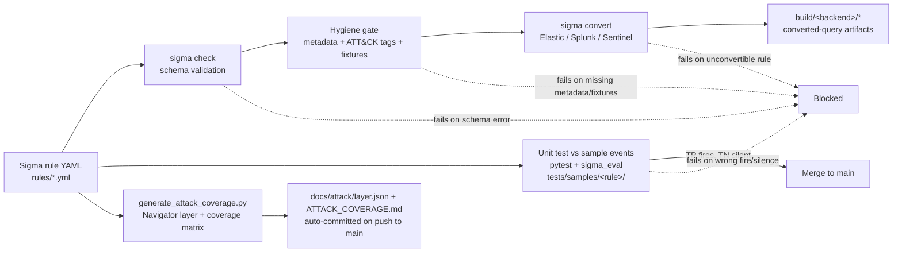

# Detection-as-Code

[](https://github.com/John-Axe/detection-as-code/actions/workflows/ci.yml)
[](https://github.com/John-Axe/detection-as-code/actions/workflows/codeql.yml)
[](https://securityscorecards.dev/viewer/?uri=github.com/John-Axe/detection-as-code)


Manage SIEM detections like software: every rule is version-controlled, reviewed
via pull request, automatically validated, and **unit-tested against sample logs
before it can merge**. No more shipping a broken rule to production and finding
out it doesn't fire during an incident.

This repo carries detections in **two formats side by side**:

- **Sigma** (`rules/`) — vendor-neutral YAML that converts to Elastic, Splunk,
  Sentinel, and others.
- **Elastic detection-rules TOML** (`rules_toml/`) — the native format of the
  [elastic/detection-rules](https://github.com/elastic/detection-rules) project,
  with ECS field names, ATT&CK threat mapping, and KQL queries.

Both halves are validated and unit-tested in CI.

## Why this exists

In a lot of teams, detection rules live in a console where they can't be diffed,
reviewed, or tested. This repo treats them as code:

- **Version control** — full history of every rule change.
- **Peer review** — changes land through PRs, not clicks in a UI.
- **Validation** — `sigma check` (pySigma) for Sigma; a schema + ATT&CK validator
  for the TOML rules.
- **Hygiene gate** — every rule is required to carry an ATT&CK technique tag,
  author, references, and severity, and to ship with test fixtures. Missing
  any of that fails the build, not just a style nit.
- **Testing** — every rule ships with true-positive and true-negative sample
  events; CI proves the rule fires on the bad ones and stays silent on the good.
- **Multi-SIEM conversion** — every Sigma rule is converted to Elastic Lucene,
  Splunk SPL, and Microsoft Sentinel KQL on every push, so a rule that can't
  translate to a target SIEM is caught before merge, not in production.

## How it works



Every push and pull request runs validation, the hygiene gate, conversion, and
tests in GitHub Actions (`.github/workflows/ci.yml`). A red check blocks the
merge — a rule with no passing tests, missing metadata, a broken schema, or a
query that fails to convert never reaches production. Separately, CodeQL and
OpenSSF Scorecard scan the repo's own code and supply chain on a schedule (see
[Security](#security) below).

## Repo layout

```
rules/                              Sigma detection rules (YAML)
rules_toml/                         Elastic-style detection rules (TOML, KQL, ECS)
scripts/convert_rules.sh            Sigma -> Elastic/Splunk/Sentinel, writes build/<backend>/*
scripts/generate_attack_coverage.py Builds docs/attack/layer.json + docs/ATTACK_COVERAGE.md
scripts/check_hygiene.py            CI gate: required metadata + test fixtures present
build/                               Converted query artifacts (gitignored, CI-generated)
docs/
  attack/layer.json                 MITRE ATT&CK Navigator layer (auto-committed)
  ATTACK_COVERAGE.md                Tactic/technique coverage matrix (auto-committed)
tests/
  sigma_eval.py                     minimal Sigma evaluator (fields, modifiers, and/or/not conditions)
  kql_eval.py                       minimal KQL evaluator (for TOML rules)
  validate_toml.py                  TOML schema + ATT&CK validator (CI gate)
  test_rules.py                     tests over every Sigma rule
  test_toml_rules.py                tests over every TOML rule
  samples/<rule-stem>/               positive.json / negative.json  (Sigma)
  samples_toml/<rule-stem>/          positive.json / negative.json  (TOML, ECS fields)
.github/workflows/ci.yml             validate + hygiene gate + convert + test on every push/PR
.github/workflows/attack-coverage.yml  regenerates + auto-commits the ATT&CK layer/matrix on push to main
.github/workflows/codeql.yml         CodeQL static analysis (push/PR/weekly)
.github/workflows/scorecard.yml      OpenSSF Scorecard (push to main/weekly)
.github/dependabot.yml               weekly dependency updates (pip + github-actions)
```

## Current detections

| Rule | Sigma | TOML | ATT&CK | Level |
|------|:-----:|:----:|--------|-------|
| Suspicious PowerShell EncodedCommand Execution | ✓ | ✓ | T1059.001 | high |
| AWS Root Account Console Login | ✓ | ✓ | T1078.004 | high |
| AWS Console Login Without MFA | ✓ | ✓ | T1078.004 | high |
| IAM Policy Attached to a User | ✓ | ✓ | T1098.001 | medium |

## ATT&CK coverage

Generated by `scripts/generate_attack_coverage.py` from the ATT&CK tags on
every rule in `rules/`, and auto-committed by `.github/workflows/attack-coverage.yml`
on every push to `main`. Import [`docs/attack/layer.json`](docs/attack/layer.json)
into the [ATT&CK Navigator](https://mitre-attack.github.io/attack-navigator/)
to view it visually.

<!-- ATTACK_COVERAGE_START -->
| Tactic | Technique | Name | Rules |
|--------|-----------|------|-------|
| Initial Access | T1078.004 | Cloud Accounts | aws_console_login_without_mfa, aws_root_console_login |
| Execution | T1059.001 | PowerShell | windows_powershell_encodedcommand |
| Persistence | T1098.001 | Additional Cloud Credentials | aws_iam_policy_attached_to_user |
| Privilege Escalation | T1098.001 | Additional Cloud Credentials | aws_iam_policy_attached_to_user |
<!-- ATTACK_COVERAGE_END -->

Full matrix with notes: [`docs/ATTACK_COVERAGE.md`](docs/ATTACK_COVERAGE.md).

## Run it locally

```bash
pip install -r requirements.txt
sigma check rules/                    # validate Sigma syntax + schema
python tests/validate_toml.py         # validate Elastic TOML rules
python scripts/check_hygiene.py       # hygiene gate: metadata + test fixtures
./scripts/convert_rules.sh            # convert Sigma -> Elastic/Splunk/Sentinel into build/
python scripts/generate_attack_coverage.py  # regenerate the ATT&CK layer + matrix
pytest -v                             # run all detection unit tests
```

## Add a new detection

A rule isn't done until it satisfies the hygiene gate (`scripts/check_hygiene.py`):
author, references, severity/level, an ATT&CK technique tag, and both sample
fixtures. To add one:

1. Write the rule in `rules/your_rule.yml` (Sigma) and/or
   `rules_toml/your_rule.toml` (Elastic). The Sigma rule must include `author`,
   `references`, `level`, and a `tags` entry matching `attack.tXXXX[.YYY]`
   (e.g. `attack.t1078`); the TOML rule must include `rule.author`,
   `rule.references`, `rule.severity`, and an `[[rule.threat]]` ATT&CK mapping.
2. Add `positive.json` (events it should catch) and `negative.json` (events it
   should ignore) under the matching `tests/samples*/your_rule/` directory.
3. Run `sigma check rules/`, `python scripts/check_hygiene.py`,
   `./scripts/convert_rules.sh`, and `pytest -v` until everything is green,
   then open a PR. CI re-runs the same gates on every push, and
   `attack-coverage.yml` regenerates the coverage layer/matrix once it merges
   to `main`.

## Convert a Sigma rule to your SIEM

```bash
sigma convert -t lucene rules/windows_powershell_encodedcommand.yml -p ecs_windows  # Elastic
sigma convert -t splunk --without-pipeline rules/aws_root_console_login.yml         # Splunk SPL
sigma convert -t kusto --without-pipeline rules/aws_root_console_login.yml          # Sentinel KQL
```

## Security

- **CodeQL** (`.github/workflows/codeql.yml`) — static analysis on every push,
  pull request, and weekly schedule; results land in the repo's
  [Security tab](../../security/code-scanning).
- **OpenSSF Scorecard** (`.github/workflows/scorecard.yml`) — supply-chain
  posture check on push to `main` and weekly; SARIF uploaded to the Security
  tab; badge above.
- **Dependabot** (`.github/dependabot.yml`) — weekly update PRs for both the
  `pip` and `github-actions` ecosystems.
- **gitleaks** — independent secret-scanning step in `ci.yml` on every push
  and pull request, as a second opinion alongside Scorecard/CodeQL.
- **Pinned actions** — every third-party GitHub Action in every workflow is
  pinned to a full commit SHA (with the version in a trailing comment), each
  workflow declares a least-privilege `permissions:` block (default
  `contents: read`, with only the additional scopes a job needs), and a
  `concurrency` group cancels superseded runs.

## Impact

Every one of the 4 shipped rules carries both a true-positive and a
true-negative fixture, required metadata, and an ATT&CK technique tag; CI runs
20+ assertions per push and blocks the merge if any rule fires on the wrong
event, fails to convert to Elastic/Splunk/Sentinel, or ships without its
hygiene metadata — turning "did this detection actually work, and is it
documented?" from a question asked during an incident into one answered
automatically before the rule ever reaches production.
